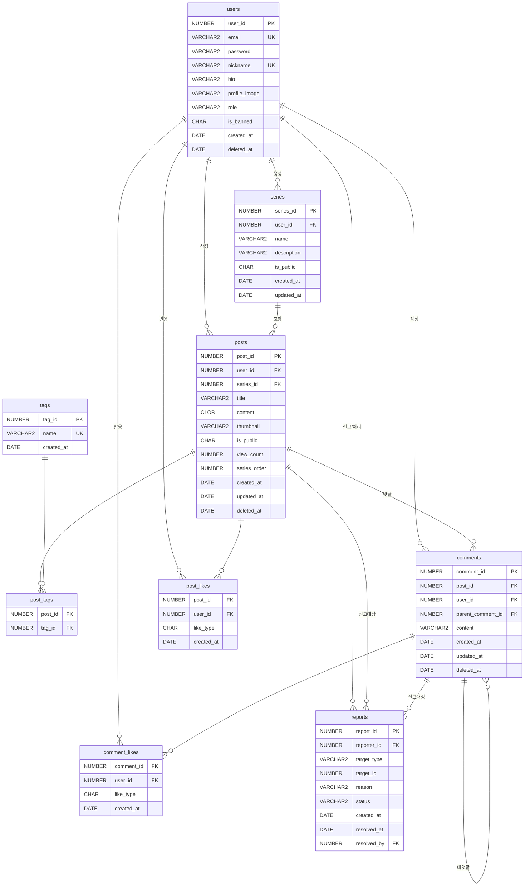

# ERD — 나만의 학습 기록 블로그 플랫폼

# 테이블 목록

| 테이블명 | 설명 |
| --- | --- |
| `users` | 회원 정보 (role 포함) |
| `posts` | 게시글 |
| `tags` | 태그 목록 |
| `post_tags` | 게시글-태그 매핑 (N:M) |
| `series` | 시리즈 |
| `comments` | 댓글 및 대댓글 (self-reference) |
| `post_likes` | 게시글 좋아요/싫어요 |
| `comment_likes` | 댓글 좋아요/싫어요 |
| `reports` | 게시글/댓글 신고 |

---

# 테이블 상세 정의

## 1. users (회원)

| 컬럼명 | 타입 | 제약조건 | 설명 |
| --- | --- | --- | --- |
| `user_id` | NUMBER | PK, NOT NULL | 회원 고유 ID (시퀀스) |
| `email` | VARCHAR2(100) | UNIQUE, NOT NULL | 로그인 이메일 |
| `password` | VARCHAR2(255) | NOT NULL | 암호화된 비밀번호 (BCrypt) |
| `nickname` | VARCHAR2(50) | UNIQUE, NOT NULL | 닉네임 |
| `bio` | VARCHAR2(200) | NULL | 한 줄 소개 |
| `profile_image` | VARCHAR2(500) | NULL | 프로필 이미지 경로 |
| `role` | VARCHAR2(10) | NOT NULL, DEFAULT 'USER' | 권한 ('USER' / 'ADMIN') |
| `is_banned` | CHAR(1) | NOT NULL, DEFAULT 'N' | 계정 정지 여부 ('Y' / 'N') |
| `created_at` | DATE | NOT NULL, DEFAULT SYSDATE | 가입일 |
| `deleted_at` | DATE | NULL | 탈퇴일 (소프트 삭제) |

**인덱스**: `email` (UNIQUE), `nickname` (UNIQUE), `role`

> 로그인 흐름: 사용자가 **이메일+비밀번호** 입력 → DB에서 email로 조회 → BCrypt 검증 → 세션에 `user_id` + `role` 저장 → 이후 모든 요청은 세션의 `user_id`로 권한 체크, 관리자 페이지는 `role = 'ADMIN'` 확인
> 

---

## 2. posts (게시글)

| 컬럼명 | 타입 | 제약조건 | 설명 |
| --- | --- | --- | --- |
| `post_id` | NUMBER | PK, NOT NULL | 게시글 고유 ID (시퀀스) |
| `user_id` | NUMBER | FK → users.user_id, NOT NULL | 작성자 |
| `series_id` | NUMBER | FK → series.series_id, NULL | 시리즈 (없으면 NULL) |
| `title` | VARCHAR2(100) | NOT NULL | 제목 |
| `content` | CLOB | NOT NULL | 본문 (마크다운) |
| `thumbnail` | VARCHAR2(500) | NULL | 썸네일 이미지 경로 |
| `is_public` | CHAR(1) | NOT NULL, DEFAULT 'Y' | 공개 여부 (Y/N) |
| `view_count` | NUMBER | NOT NULL, DEFAULT 0 | 조회수 |
| `series_order` | NUMBER | NULL | 시리즈 내 순서 |
| `created_at` | DATE | NOT NULL, DEFAULT SYSDATE | 작성일 |
| `updated_at` | DATE | NULL | 수정일 |
| `deleted_at` | DATE | NULL | 삭제일 (소프트 삭제) |

**인덱스**: `user_id`, `series_id`, `created_at DESC`, `is_public`

---

## 3. tags (태그)

| 컬럼명 | 타입 | 제약조건 | 설명 |
| --- | --- | --- | --- |
| `tag_id` | NUMBER | PK, NOT NULL | 태그 고유 ID (시퀀스) |
| `name` | VARCHAR2(50) | UNIQUE, NOT NULL | 태그명 |
| `created_at` | DATE | NOT NULL, DEFAULT SYSDATE | 생성일 |

**인덱스**: `name` (UNIQUE)

---

## 4. post_tags (게시글-태그 매핑)

| 컬럼명 | 타입 | 제약조건 | 설명 |
| --- | --- | --- | --- |
| `post_id` | NUMBER | PK, FK → [posts.post](http://posts.post)_id, NOT NULL | 게시글 ID |
| `tag_id` | NUMBER | PK, FK → tags.tag_id, NOT NULL | 태그 ID |

**복합 PK**: (`post_id`, `tag_id`)

**인덱스**: `tag_id`

> 게시글당 최대 5개 태그 — 애플리케이션 레이어에서 제한
> 

---

## 5. series (시리즈)

| 컬럼명 | 타입 | 제약조건 | 설명 |
| --- | --- | --- | --- |
| `series_id` | NUMBER | PK, NOT NULL | 시리즈 고유 ID (시퀀스) |
| `user_id` | NUMBER | FK → users.user_id, NOT NULL | 작성자 |
| `name` | VARCHAR2(100) | NOT NULL | 시리즈 이름 |
| `description` | VARCHAR2(500) | NULL | 시리즈 설명 |
| `is_public` | CHAR(1) | NOT NULL, DEFAULT 'Y' | 공개 여부 (Y/N) |
| `created_at` | DATE | NOT NULL, DEFAULT SYSDATE | 생성일 |
| `updated_at` | DATE | NULL | 수정일 |

**인덱스**: `user_id`

---

## 6. comments (댓글 & 대댓글)

| 컬럼명 | 타입 | 제약조건 | 설명 |
| --- | --- | --- | --- |
| `comment_id` | NUMBER | PK, NOT NULL | 댓글 고유 ID (시퀀스) |
| `post_id` | NUMBER | FK → [posts.post](http://posts.post)_id, NOT NULL | 게시글 ID |
| `user_id` | NUMBER | FK → users.user_id, NOT NULL | 작성자 |
| `parent_comment_id` | NUMBER | FK → comments.comment_id, NULL | 부모 댓글 ID (NULL이면 댓글, 값 있으면 대댓글) |
| `content` | VARCHAR2(1000) | NOT NULL | 댓글 내용 |
| `created_at` | DATE | NOT NULL, DEFAULT SYSDATE | 작성일 |
| `updated_at` | DATE | NULL | 수정일 |
| `deleted_at` | DATE | NULL | 삭제일 (소프트 삭제) |

**인덱스**: `post_id`, `parent_comment_id`, `user_id`

> `parent_comment_id IS NULL` → 댓글 (1depth)
> 

> `parent_comment_id IS NOT NULL` → 대댓글 (2depth)
> 

> 대댓글의 `parent_comment_id`는 무조건 1depth 댓글 ID만 허용 (애플리케이션 레이어 제한)
> 

---

## 7. post_likes (게시글 좋아요/싫어요)

| 컬럼명 | 타입 | 제약조건 | 설명 |
| --- | --- | --- | --- |
| `post_id` | NUMBER | PK, FK → [posts.post](http://posts.post)_id, NOT NULL | 게시글 ID |
| `user_id` | NUMBER | PK, FK → users.user_id, NOT NULL | 회원 ID |
| `like_type` | CHAR(1) | NOT NULL | 'L' = 좋아요, 'D' = 싫어요 |
| `created_at` | DATE | NOT NULL, DEFAULT SYSDATE | 반응 일시 |

**복합 PK**: (`post_id`, `user_id`) → 1인 1회 보장

> 좋아요 → 싫어요 전환 시 UPDATE 처리 / 동일 반응 재클릭 시 DELETE (취소)
> 

---

## 8. comment_likes (댓글 좋아요/싫어요)

| 컬럼명 | 타입 | 제약조건 | 설명 |
| --- | --- | --- | --- |
| `comment_id` | NUMBER | PK, FK → comments.comment_id, NOT NULL | 댓글 ID |
| `user_id` | NUMBER | PK, FK → users.user_id, NOT NULL | 회원 ID |
| `like_type` | CHAR(1) | NOT NULL | 'L' = 좋아요, 'D' = 싫어요 |
| `created_at` | DATE | NOT NULL, DEFAULT SYSDATE | 반응 일시 |

**복합 PK**: (`comment_id`, `user_id`) → 1인 1회 보장

> 좋아요 → 싫어요 전환 시 UPDATE 처리 / 동일 반응 재클릭 시 DELETE (취소)
> 

---

## 9. reports (신고)

| 컬럼명 | 타입 | 제약조건 | 설명 |
| --- | --- | --- | --- |
| `report_id` | NUMBER | PK, NOT NULL | 신고 고유 ID (시퀀스) |
| `reporter_id` | NUMBER | FK → users.user_id, NOT NULL | 신고한 회원 ID |
| `target_type` | VARCHAR2(10) | NOT NULL | 신고 대상 유형 ('POST' / 'COMMENT') |
| `target_id` | NUMBER | NOT NULL | 신고 대상 ID (post_id 또는 comment_id) |
| `reason` | VARCHAR2(500) | NOT NULL | 신고 사유 |
| `status` | VARCHAR2(10) | NOT NULL, DEFAULT 'PENDING' | 처리 상태 ('PENDING' / 'RESOLVED' / 'DISMISSED') |
| `created_at` | DATE | NOT NULL, DEFAULT SYSDATE | 신고 일시 |
| `resolved_at` | DATE | NULL | 처리 일시 |
| `resolved_by` | NUMBER | FK → users.user_id, NULL | 처리한 관리자 ID |

**인덱스**: `reporter_id`, `target_type + target_id`, `status`

> 동일 사용자가 동일 대상 중복 신고 방지: 애플리케이션 레이어에서 체크
> 

---

# 테이블 관계 요약

| 관계 | 설명 |
| --- | --- |
| users → posts | 1:N (한 회원이 여러 게시글 작성) |
| users → series | 1:N (한 회원이 여러 시리즈 생성) |
| users → comments | 1:N (한 회원이 여러 댓글 작성) |
| users → reports | 1:N (신고자 / 처리 관리자) |
| series → posts | 1:N (한 시리즈에 여러 게시글) |
| posts ↔ tags | N:M (post_tags 중간 테이블) |
| posts → comments | 1:N (한 게시글에 여러 댓글) |
| comments → comments | 1:N (self-reference, 댓글→대댓글) |
| posts ↔ users (likes) | N:M (post_likes, like_type 포함) |
| comments ↔ users (likes) | N:M (comment_likes, like_type 포함) |

---

# ERD 다이어그램 (Mermaid)

---

# 시퀀스 목록 (Oracle)

| 시퀀스명 | 사용 테이블 |
| --- | --- |
| `SEQ_USER_ID` | users.user_id |
| `SEQ_POST_ID` | [posts.post](http://posts.post)_id |
| `SEQ_TAG_ID` | tags.tag_id |
| `SEQ_SERIES_ID` | series.series_id |
| `SEQ_COMMENT_ID` | comments.comment_id |
| `SEQ_REPORT_ID` | [reports.report](http://reports.report)_id |

---

# 설계 결정 사항 (Design Decisions)

| 항목 | 결정 | 이유 |
| --- | --- | --- |
| 소프트 삭제 | `deleted_at` 컬럼 사용 | 데이터 복구 가능성, 잔디심기 통계 보존 |
| 댓글 구조 | Self-reference (parent_comment_id) | 단순 2depth 구조에 적합, 별도 테이블 불필요 |
| 좋아요/싫어요 | `like_type` 컬럼 (L/D) | 하나의 테이블로 두 반응 모두 관리, 전환 시 UPDATE |
| 관리자 구분 | users.role ('USER'/'ADMIN') | 별도 테이블 불필요, 세션에 role 저장 후 접근 제어 |
| 신고 대상 | `target_type`  • `target_id` | POST/COMMENT 모두 단일 테이블로 관리 |
| 비밀번호 | BCrypt 해시 저장 | 평문 저장 금지 |
| 조회수 | posts.view_count 컬럼 | 세션 기반 중복 방지는 애플리케이션에서 처리 |